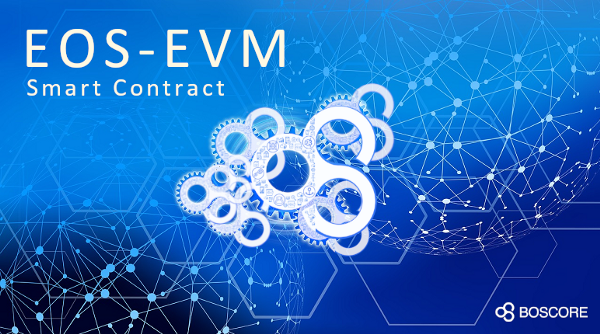

# EOSIO smart contract challenge
medium link https://medium.com/boscore/eos-evm-smart-contract-60b00cd973fa  
youtube link https://youtu.be/8azGNY0OKLk  

This project is designed and implemented to full-fill [EOSIO Challenge](https://eosio.devpost.com). It provides
- An eosio smart contract to simulate EVM [eos-challenge-contract
](https://github.com/eosiosg/eos-challenge-contract)
- An SDK to deploy and use the contract [eos_evm_sdk](https://github.com/eosiosg/eos_evm_sdk)
- A tester project [vm-test
](https://github.com/eosiosg/vm-test) to test the contract using [eth tests](https://github.com/ethereum/tests)
- Practical [use cases discussion](./use_case_discussion.md) in real world
- Detailed documentations


## Project Structure
```
--
  |- eos-challenge-contract   //challenge contract source code and pre-built wasm
  |- eos_evm_sdk  //sdk to deploy and use contract, include examples: hello-world, ERC20 and ERC721
  |- vm-test //use ethereum/tests to test challenge contract
```

## Features and Highlights
> terms, e.g. BFSP, account types, are explained in Appendix

- Simulate an EVM Interpreter in EOSIO smart contract and execute EVM transactions as faithfully to the Ethereum Yellow Paper as possible
- NO CHANGES to the EOSIO software
- Follow EVMC standard.
- Fully support all EVMC_REVISIONs
- An tester project [vm-test](https://github.com/eosiosg/vm-test) is developed to test [VMTest](https://github.com/ethereum/tests/tree/7497b116a019beb26215cbea4028df068dea06be)
- Support dry-run transaction execution. //`simulate` action in smart contract
- Example EVM contracts are provided.
- Use cases and extensions are discussed [here](./use_case_discussion.md).
- a demo account in test-net can be found [here](https://jungle.bloks.io/account/eosevm111111)
- Detailed Functions
    - EOS user can create a eth address associated with his/her EOS account, and use EOS account private key to execute challenge transactions.
    - ETH user can create an account through BFSP by provide an eth address. Afterwards the ETH user can call EVM contracts (deployed in challenge contract) exactly the same way as in ETH, except that a BFSP is needed to forward transactions.
    - The challenge contract can link customisable external token contract and symbol.
    - Associated accounts can transfer/withdraw linked token between external token contract and challenge contract.
    - All accounts can use EVM transfer transaction to send linked token inside the challenge contract.
    - All accounts can deploy and execute EVM bytecode, and contract address is created following ETH rules.
    - GAS fee is calculated but not billed.
    - Persist smart contract data with native EOSIO multi-index. Revert **dirty state** if vm execution failed.
    - Detailed challenge requirements are discussed in "eos-challenge-contract project", such as GAS fee, chain-id, nonce and so on.

## Appendix
### terms
account types:
1. associated account: account is associated with EOS account.
2. non-associated account: account is not associated with EOS account.

eth address generation rules:
1. associated account type: use [eosio account]+[arbitrary string] as input to Keccak to generate eth address.
2. non-associated account type: eth public key as input to Keccak to generate eth address.

BFSP:
1. blind forward service provider
2. BFSP works as an intermediate EOS account to facilitate ETH users to interact with EOS blockchain. It accepts any transaction data, signs using its own EOS account, forwards to EOS blockchain and pays required CPU/NET/RAM. It can be a friend owning an EOS account, or a dedicated service provider.

action "raw" validation types:
1. validate by eos address
- should be used by and only by associated account
- transaction structure: [eth transaction data][eth address][eos signature]
2. validate by eth signature
- should be used by and only by non-associated account type
- transaction structure: [eth transaction data][eth signature][eos BFSP signature]
